# pro-AsixcA-grup4

BLOQUE 1: ARQUITECTURA DEL ESPACIO FÍSICO, DISEÑO ESTRUCTURAL Y SEGURIDAD

1.1.Nuestra Ubicación Estratégica de la Sala e Integración Sostenible

Nuestro diseño del Centro de Procesamiento de Datos (CPD) para Innovate Tech parte de la premisa de que la seguridad física del mundo real es la base indispensable para la estabilidad del entorno digital. 
Aprovechando la disponibilidad de nuestro presupuesto sin restricciones y con el objetivo de alcanzar la máxima eficiencia ecológica, determinamos la implantación de la sala en la planta intermedia del edificio corporativo.
Con esta decisión arquitectónica responde a nuestra doble estrategia de mitigación de riesgos ambientales y optimización de recursos:
Aislamiento frente a desastres naturales: Nosotros descartamos por completo los sótanos y las plantas bajas, eliminando de raíz la vulnerabilidad ante inundaciones provocadas por roturas en las redes generales de agua o por lluvias torrenciales que pongan en peligro la integridad del hardware. Asimismo, al evitar el ático o la última planta, nosotros esquivamos las filtraciones de agua por cubiertas y la radiación térmica solar directa.
Eficiencia energética pasiva: Nosotros proyectamos el CPD en el núcleo geométrico de la planta, rodeado por zonas comunes de oficinas. Estas oficinas actúan como un colchón térmico natural que aísla los servidores de las fluctuaciones de temperatura del exterior del edificio. Al no sufrir el impacto directo del clima de la calle, hacemos que las necesidades de refrigeración disminuyan de manera drástica, reduciendo de forma directa la huella de carbono de nuestra empresa y logrando una infraestructura altamente sostenible.

# FASE 4. SERVER WEB

## 4.1. Configuración Técnica

* **SO:** Ubuntu Server 24.04
* **Software Web:** Nginx
* **Seguridad:** Implementación de acceso mediante usuarios guardados en server el LDP

Primero que todo creamos una máquina con los requisitos que queremos

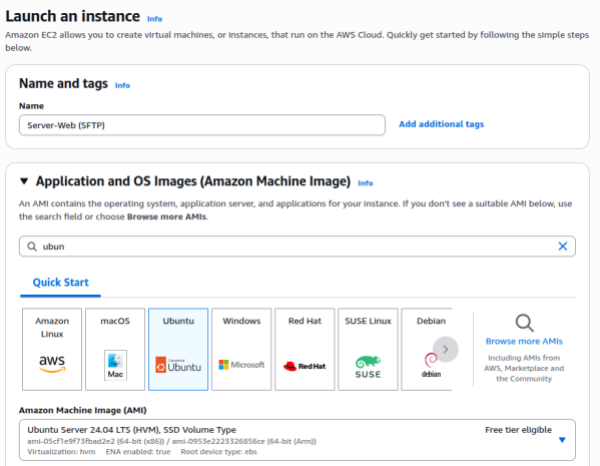
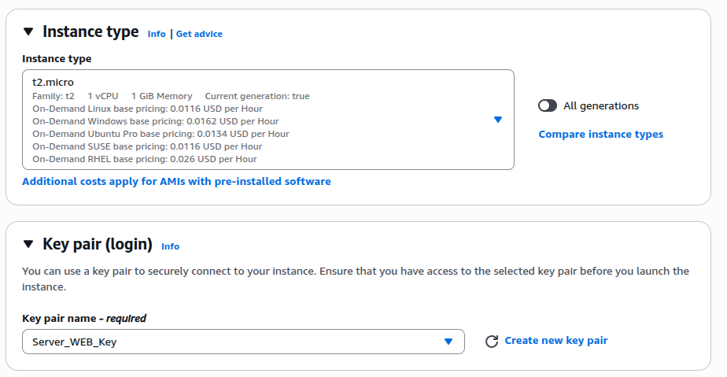
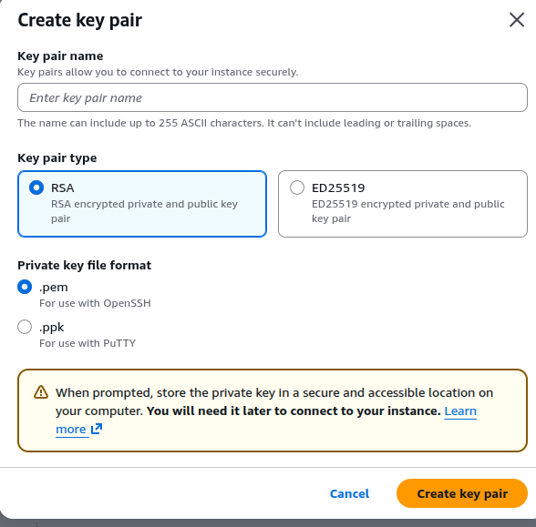
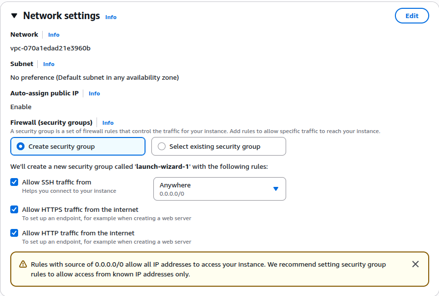
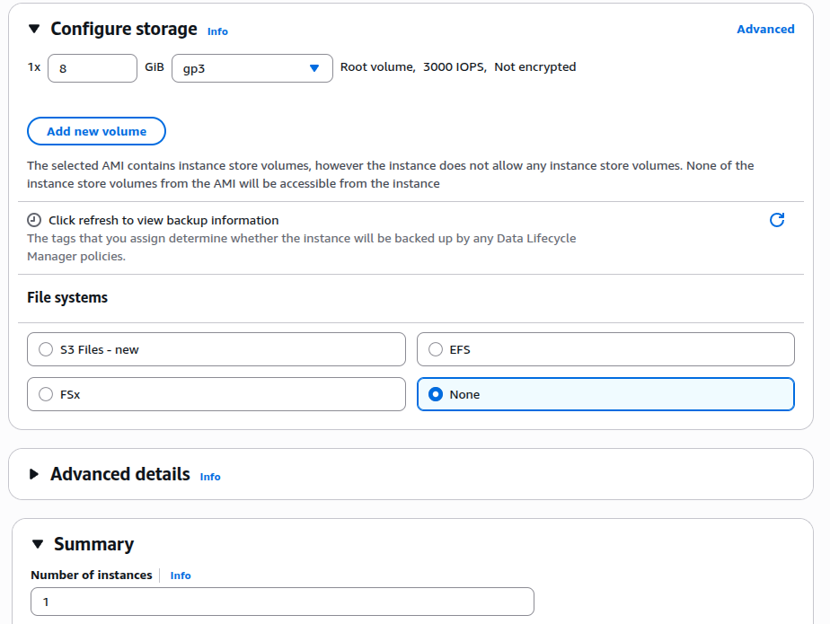
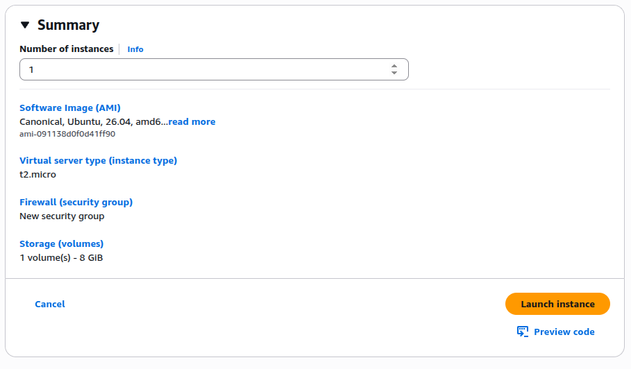
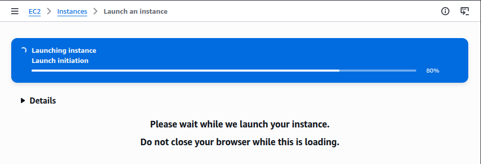
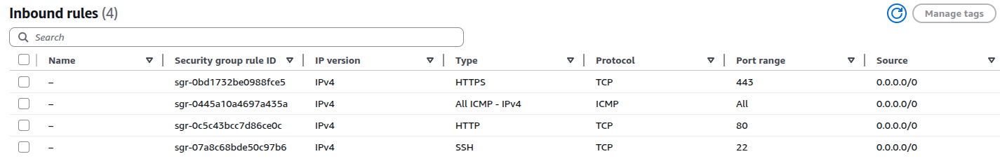

IP Elastica

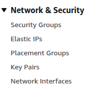
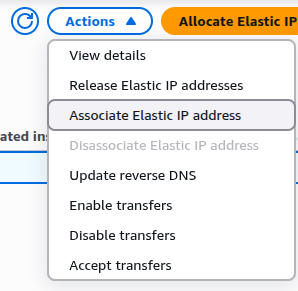
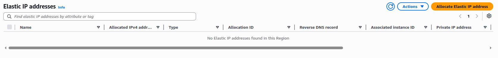
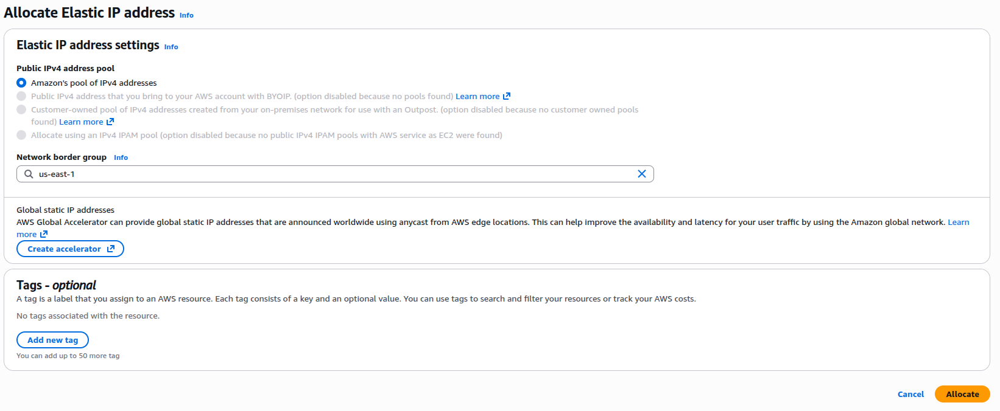
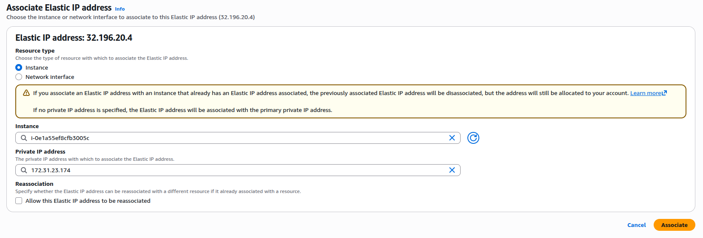
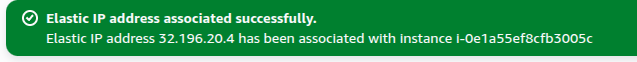

## 4.4. Procedimiento de Implementación

Antes de la instalación de cualquier servicio, hemos realizado una actualización inicial del sistema.

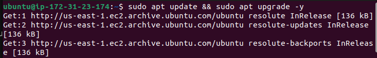
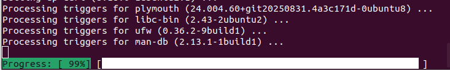

Ahora hemos creado un usuario administrativo nominal para evitar el uso del usuario ubuntu por defecto. El acceso se realiza exclusivamente mediante autenticación por clave pública RSA eliminando cualquier vulnerabilidad asociada a contraseñas.

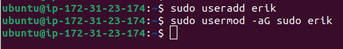

Para eliminar la dependencia de contraseñas, hemos transferido las credenciales de acceso del usuario ubuntu al nuevo usuario nominal:
Creamos el directorio de configuración SSH para el nuevo usuario
Copiamos las llaves públicas autorizadas
Ajustamos los permisos y el propietario ( Para la seguridad SSH)

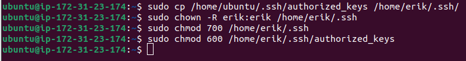
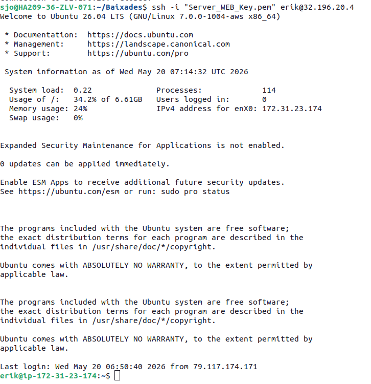

## 4.5. Aseguramiento de la Infraestructura (Firewall)

Hemos implementado una política de "denegación por defecto y solo permitimos el tráfico necesario para el funcionamiento del servidor
Configuramos la política por defecto

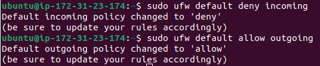

Permitimos solo los puertos necesarios
Puerto 22/TCP — Protocolo SSH
Puerto 80/TCP — Protocolo HTTP
Puerto 443/TCP — Protocolo HTTPS

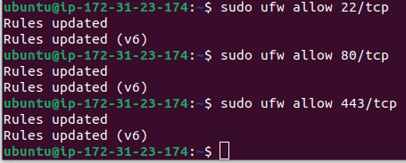

Verificamos

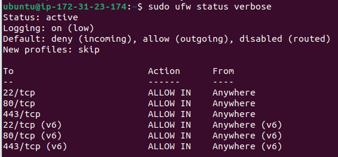

Activamos el firewall

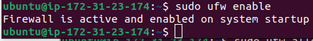

## Implementación del Servicio de Transferencia de Ficheros (SFTP)

Para cubrir el requerimiento de transferencia segura de archivos, hemos configurado un servicio SFTP con aislamiento (Chroot). Este diseño garantiza que los usuarios puedan subir y descargar archivos sin que tengan privilegios para navegar por las carpetas del sistema.
Editamos el archivo de configuración de SSH ya añadimos esta línea:

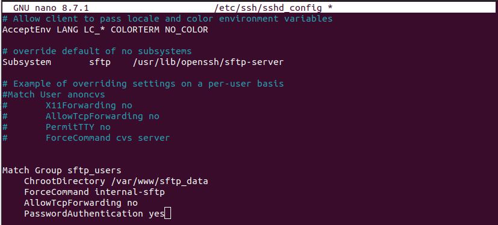

Hemos usado ChrootDirectory para crear una 'cárcel' lógica. Esto permite que cualquier persona  gestione archivos en el servidor con la total seguridad de que su acceso está limitado únicamente a los directorios autorizados, protegiendo la integridad del sistema operativo central.

## Instalación del servidor web

Hemos optado por Nginx debido a su arquitectura basada en eventos, la cual gestiona las peticiones de forma más eficiente que los servidores web tradicionales. Esto nos permite garantizar una alta disponibilidad.

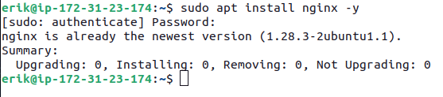
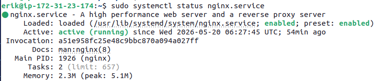

Nginx no usa VirtualHost como Apache, usa lo que se llaman server blocks. Vamos a crear uno nuevo para la empresa.

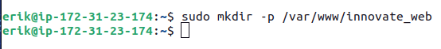

Ahora creamos el índice el cual vamos a ver al acceder a la página y ponemos una frase de prueba

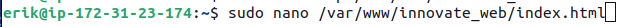

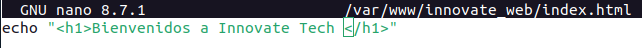

Por último crearemos y configuraremos el fichero de configuración y lo activaremos 

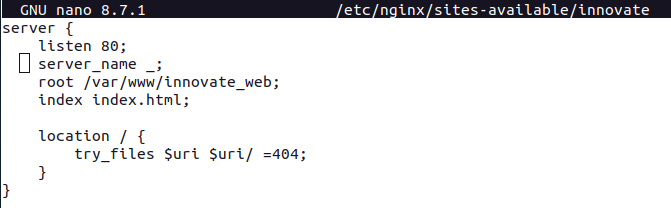

Comprobamos que no hay errores de sintaxis 

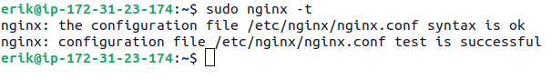

Añadimos el enlace lógico para que la configuración se active en la web y reiniciamos.

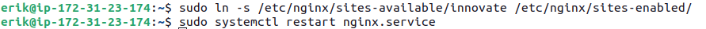

También eliminaremos los archivos por defecto para asegurar que solo pueda acceder a nuestra web.

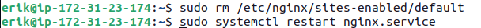

Verfificacion:

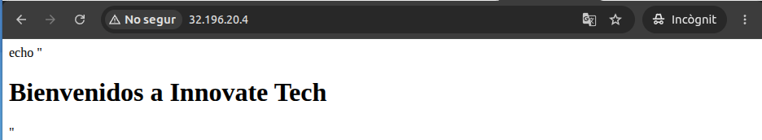

## Conexión con la Base de Datos
Instalamos el cliente mariadb para que nos podamos conectar

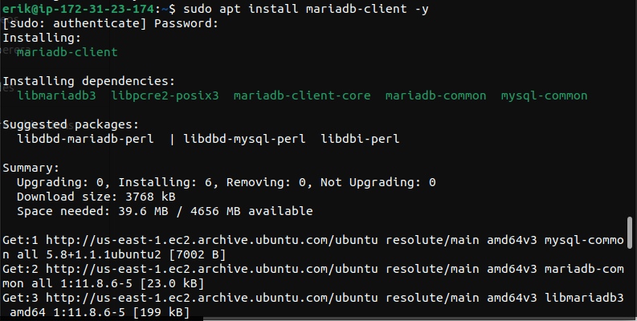

Mostrem com el port de SQL és accessible.

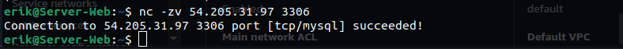

I aquí podem veure com podem entrar a la BBDD desde el web server amb les dades que ens han proporcionat.

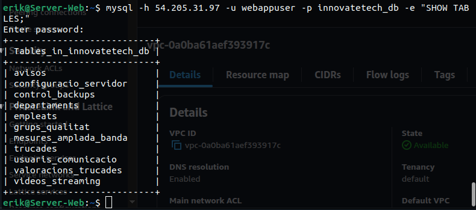

Una vegada comprovat que podem accedir a la Base de Dades creem un arxiu dins del directori creat anteriorment (/var/www/innovate_web) y configurem amb els paràmetres que hem vist anteriorment.

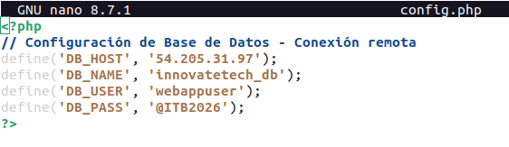

## 4.6. Página Web
Usaremos php ya que HTML es estático, el servidor web se limita a transmitir el archivo tal cual está almacenado en el disco duro hacia el navegador del cliente, el cual realiza el trabajo.

Como ahora vamos a usar formato php, tenemos que instalar los paquetes necesarios para que pueda trabajar sin problemas ya que si no los instalamos es como que el servidor no puede leer o traducir esos datos.

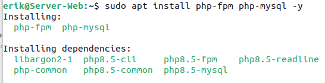

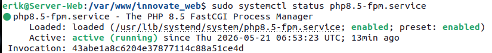

Ahora para aplicarlo tenemos que editar el fichero de configuración de nginx que hemos utilizado anteriormente para cambiar a php 

IMPORTANTE QUE PONGAMOS LA VERSIÓN QUE ESTAMOS USANDO 

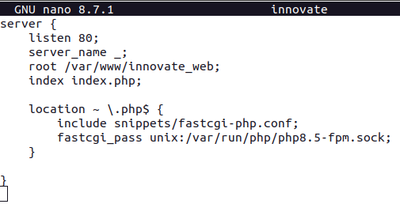

## Archivos Creados
Para la  web, se ha desplegado un árbol de archivos donde cada componente cumple una función específica dentro de la aplicación:

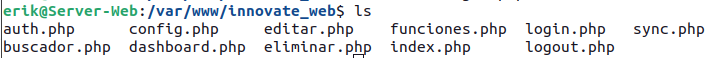

### config.php (Configuración): 
Este archivo es fundamental porque aquí es donde se configura la conexión a la base de datos. Guarda los datos clave como la dirección IP del servidor (54.205.31.97), el usuario, la contraseña y el nombre de la base de datos.

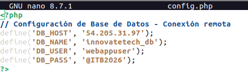

### funciones.php (Herramientas): 
Es como una caja de herramientas. Contiene funciones de ayuda que se usan en la web, como por ejemplo el código necesario para transformar los datos de las tablas en un archivo descargable de Excel o CSV.

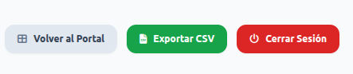

### auth.php : 
Es el vigilante de la web. Su única función es revisar si alguien intenta entrar a la web escribiendo la dirección IP sin haberse identificado, este archivo lo detecta y lo envía directamente a la pantalla de login.

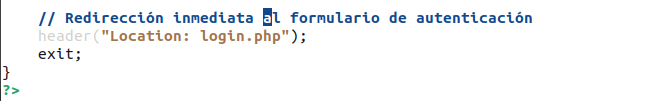

### login.php (Pantalla de Acceso): 
Es el formulario donde el usuario pone su nombre y contraseña. Este archivo habla con el servidor de la empresa (LDAP/Directorio Activo) para comprobar que el usuario realmente trabaja ahí y que sus datos son correctos. 

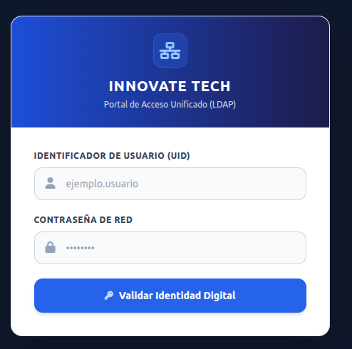

Aquí podemos ver la parte del archivo que hemos configurado para que se pueda conectar al Servidor LDAP

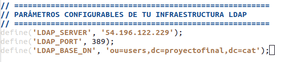

### dashboard.php (Panel de Bienvenida): 
Es la primera pantalla que se ve al poner bien su contraseña. Le da la bienvenida, le muestra su nombre de usuario le da acceso a la gestión de las tablas.

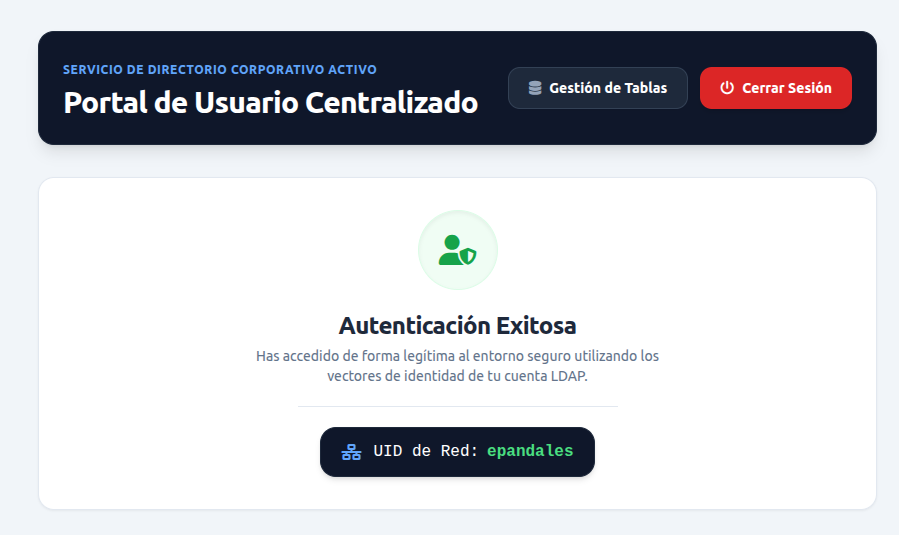

### index.php (Pantalla Principal de Gestión): 
Es la página central de nuestro proyecto donde se junta todo. Muestra el menú lateral con las 11 tablas de la base de datos, el buscador en tiempo real, la tabla con los datos de los empleados o alertas, y los botones para exportar o cerrar sesión.

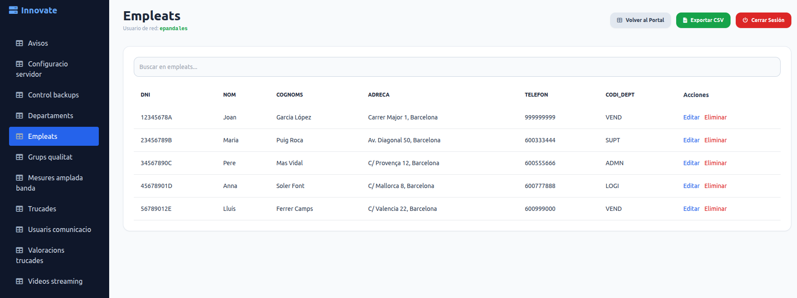

### buscador.php (El Motor de Búsqueda): 
Trabaja en segundo plano. Cuando el usuario escribe una letra en el buscador del index.php, este archivo va a la base de datos, busca lo que coincide y lo devuelve al instante.

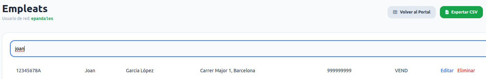

### logout.php (Cierre de Sesión): 
Su función es borrar de la memoria del servidor cuando este hace clic en "Cerrar Sesión". Limpia los accesos y bloquea la pantalla para que nadie pueda volver a entrar dándole al botón de "Atrás" del navegador.

### Editar (Modificar datos): 
Esta función permite al usuario cambiar la información de una fila que ya existe en la base de datos (por ejemplo, actualizar el departamento de un empleado o corregir una alerta de backup).

### Eliminar (Borrar datos): 
Esta función permite limpiar el sistema eliminando registros que ya no son necesarios o que son erróneos (por ejemplo, borrar un aviso viejo). 

Si le damos al botón de eliminar nos aparece este mensaje 

